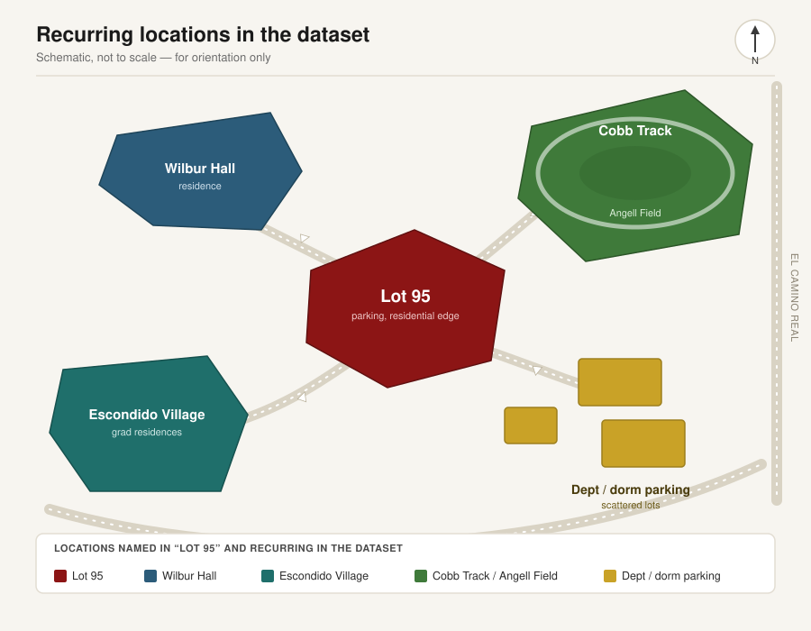

# Stanford Daily Blotter Fiction

A short story of crime at Stanford, written from [`stanforddams/daily`](https://huggingface.co/datasets/stanforddams/daily), a dataset of 139 police blotter articles published by the Stanford Daily between 2021 and 2026. The dataset covers weekly incident summaries reported to the Stanford University Department of Public Safety (SUDPS), across campus residences, academic buildings, and parking lots.

Full story: [`STORY.md`](STORY.md)

## Why this exists

The Daily's blotter turns campus crime into a fixed, repetitive vocabulary - bike theft, vehicle burglary, petty theft from a building - tagged day by day, location by location, week after week. Reading enough of it in one sitting, the pattern of the format starts to feel like a story on its own: a narrator who only ever sees crime through categories and codes, and has to notice what the categories miss. "Lot 95" is that idea worked into fiction rather than an EDA writeup. The characters and case are invented; the campus geography is real.

## The data

The dataset ships three files: `index.json` for per-article metadata (title, author, url, date, category and tag IDs), `train.jsonl` for the raw HTML body of each article, and `taxonomy.json`, which resolves the numeric category and tag IDs into labels like "bike theft" or "hate violence." The article HTML needs to be parsed (BeautifulSoup, per the dataset card) before the actual blotter text is usable - most of each page is site navigation and footer links.

One quirk that shaped the story: the human-readable blotter text and the underlying category/tag codes are separate layers. A location or incident type can repeat across the numeric metadata in a way the prose doesn't call attention to. That gap - between what the blotter says and what the taxonomy shows if you go looking - is the device the story is built around.

No article's specific incidents, dates, or content were copied into the story. Locations named (Escondido Village, Wilbur Hall, Cobb Track, Lot 95) are real, recurring places in the dataset, used only as setting.

### Dataset at a glance

- **Articles:** 139 police blotter posts
- **Time period:** September 2021 - June 2026, roughly one per week during the academic year
- **Recurring locations:** residential lots (including Lot 95), Escondido Village, Wilbur Hall, and athletic facilities around Cobb Track and Angell Field, alongside scattered department and dorm parking areas
- **Incident types:** a fixed taxonomy of categories and tags - petty theft, bike theft, burglary from a motor vehicle, vandalism, grand theft, and hate violence among them - resolved from `taxonomy.json`

## Campus map

The places that recur across the dataset, and that anchor the story's setting:



This is a schematic for orientation, not a to-scale campus map - it exists to show how often the same handful of places recur in the blotter, not to map incidents precisely.

## Getting started

```bash
git clone https://github.com/aayanahmed20/stanford-daily-blotter-fiction.git
cd stanford-daily-blotter-fiction
pip install datasets beautifulsoup4
python scripts/load_dataset.py
```

`scripts/load_dataset.py` loads the dataset and prints the parsed title and text of the first article, as a reference for exploring the rest.

## Project structure

- `STORY.md` - the short story, "Lot 95"
- `notes/dataset-notes.md` - what from the dataset's structure and geography informed the story
- `scripts/load_dataset.py` - reference script for loading and parsing the dataset
- `assets/campus-map.svg` - schematic map of the dataset's recurring locations
- `LICENSE`

## Limitations

This is a fiction exercise, not reporting. No character, event, arrest, or investigation in "Lot 95" corresponds to an actual incident, person, or case in the dataset or on record. Any resemblance to real individuals is coincidental.

## Contributors

- [@timofeywheat-wq](https://github.com/timofeywheat-wq)
